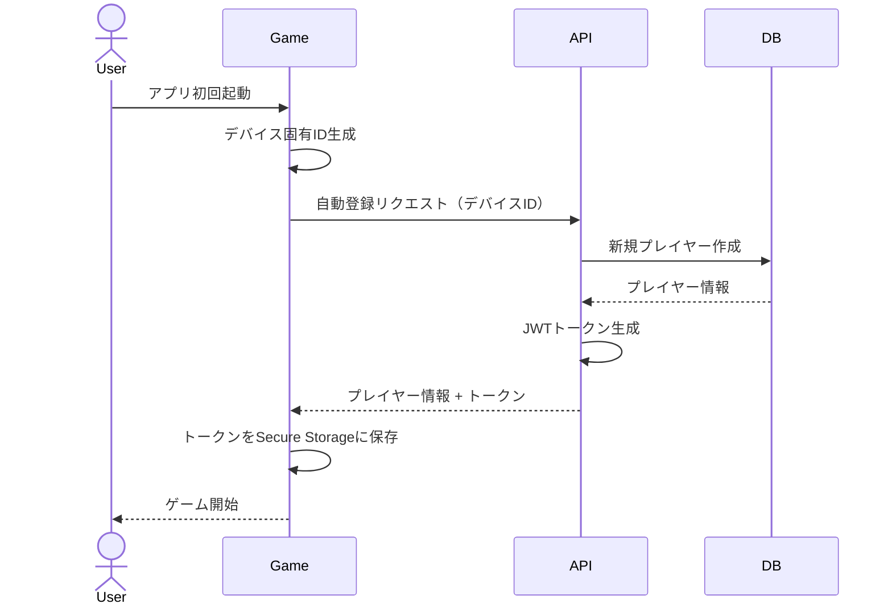
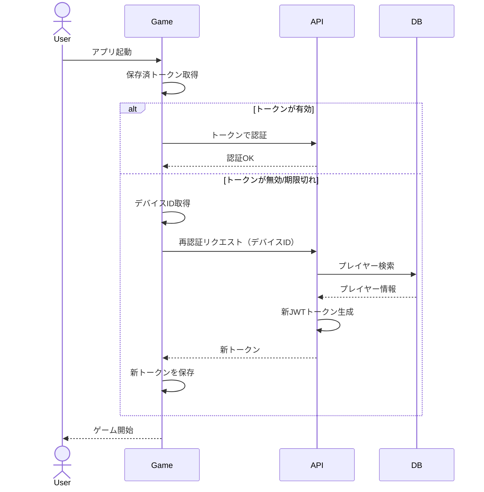
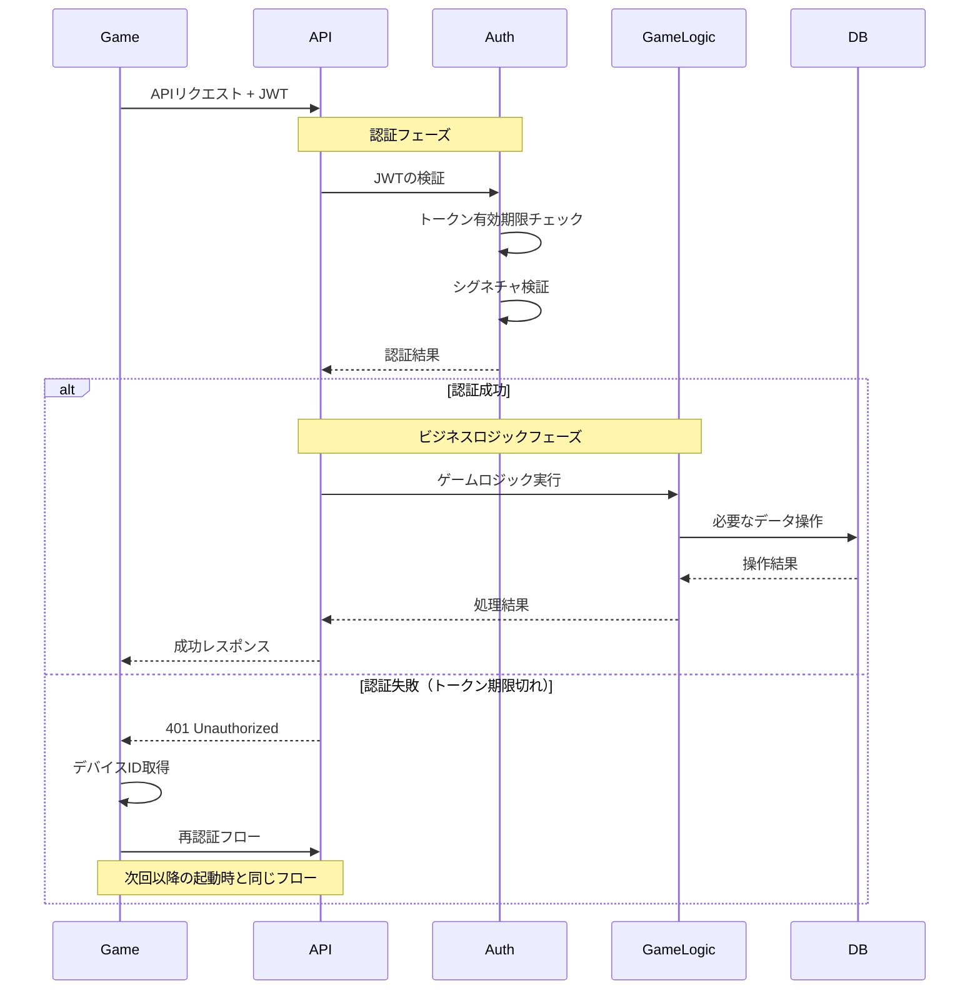

# JWT認証設計

## 概要
このドキュメントでは、カジュアルゲームに適した自動認証システムの設計について説明します。
ユーザーの明示的な操作を必要としない、シームレスな認証フローを実現します。

## 認証フロー

### 1. 初回起動時のシーケンス



### 2. 次回以降の起動時



### 3. ゲームプレイ中のAPI利用シーケンス



## 実装のポイント

### 1. デバイス識別（Capacitor + ブラウザ）

#### Web環境
- ブラウザストレージベース
  - LocalStorage: プライマリストレージ
  - IndexedDB: バックアップストレージ
- フィンガープリント技術の利用
  - Canvas指紋
  - WebGL情報
  - ブラウザ/OS情報

#### ネイティブ環境（Capacitor）
- Device API活用
  - iOS: Capacitor Device APIでIDFVを取得
  - Android: Capacitor Device APIでAndroid IDを取得
- Preferences APIでの永続化
  - @capacitor/preferences for セキュアストレージ

#### フォールバック戦略
1. Capacitor Device API試行
2. 失敗時はブラウザベースの識別子を使用
3. どちらも失敗時は新規ID生成

### 2. トークン管理
- トークン保存：デバイスのSecure Storage利用
- トークン有効期限：比較的長め（例：30日）に設定
- 自動リフレッシュ：期限切れ時に自動で再取得

### 3. セキュリティ考慮事項
- デバイスIDの暗号化：通信時は暗号化して送信
- トークンのローテーション：定期的な更新
- 不正アクセス対策：Rate Limiting実装

### 4. エラーハンドリング
- ネットワークエラー時のリトライ
- トークン検証失敗時の自動リカバリ
- デバイスID取得失敗時の代替フロー

## APIエンドポイント

1. 初回登録/認証
```
POST /api/auth/device
Request:
{
    "deviceId": "encrypted-device-identifier",
    "deviceType": "ios|android|web"
}
Response:
{
    "playerId": "uuid",
    "token": "jwt-token",
    "expiresIn": 2592000 // 30日
}
```

2. トークン再取得
```
POST /api/auth/refresh
Request:
{
    "deviceId": "encrypted-device-identifier"
}
Response:
{
    "token": "new-jwt-token",
    "expiresIn": 2592000
}